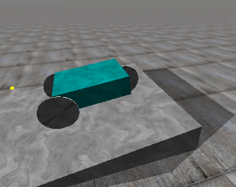
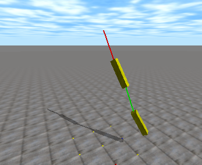
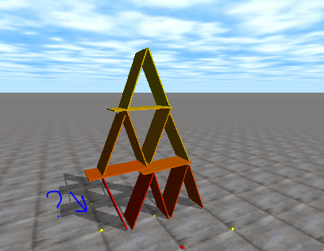
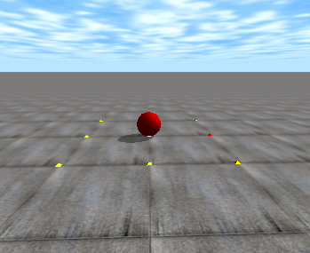
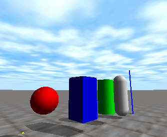
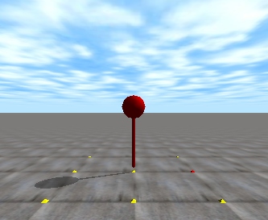

# Ode for LuaJIT

openDynamics をLuaJITで使うための ffi です。<br>
中身は.hファイルのODE_API でEXPORTされてある関数をコピペしました。

- すべての関数が使えるかは未確認です。
- ``odemath.h`` 内の関数はエクスポートされていないので必要に応じて準備する必要がある。
- 誤差があるようなので、正確な動作が必要な場合は向いてないようです。


drawstuff.dll、ode_double.dllはmingwでコンパイルしています。


# note

* open Dynamics Engine - http://www.ode.org/
* LuaJIT - http://luajit.org/


* demura.net - http://demura.net/ode
* ODE初級講座 - http://demura.net/tutorials

動作の確認用にソースを使わせていただきました。<br>

# LuaJIT ffiでコールバック関数のメモ

ffi.cdef( [[ ]] )
```
...
//typedef void dNearCallback(void *data, dGeomID o1, dGeomID o2);
typedef void (*dNearCallback)(void *data, dGeomID o1, dGeomID o2);
....
//void dSpaceCollide (dSpaceID space, void *data, dNearCallback *callback);
void dSpaceCollide (dSpaceID space, void *data, void *callback);
...
```

main lua
```
function nearCallback(data,  obj1,  obj2 )
...
end

......

-- main Sim loop
local cb = ffi.cast("dNearCallback",nearCallback)
ode.dSpaceCollide(space,nil,cb);
cb:free();
```












